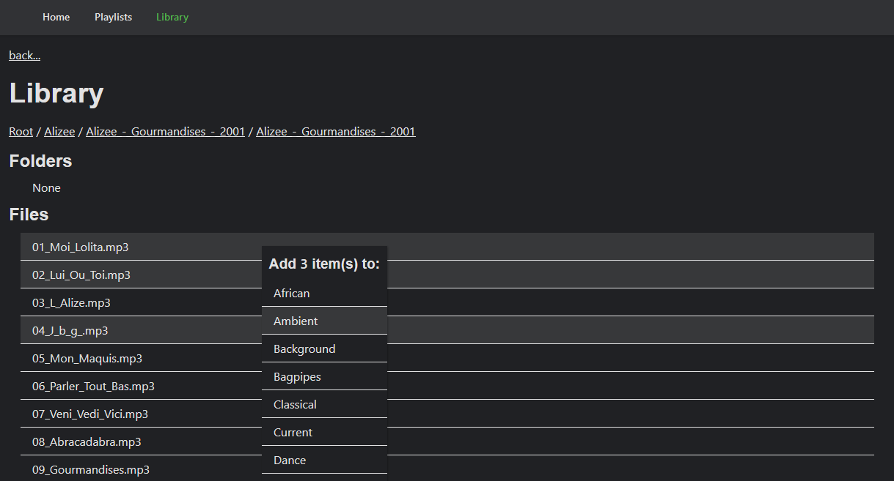

# emby-playlist-app
Web app you can locally host on the same server as your [Emby](https://emby.media/) setup to more easily create audio playlists.

## Features

 - Allows easier management of audio playlists then the standard Emby interface.
 - Allows selecting multiple files at once (using standard 'shift' and 'control' practices).
 - Allows creation of new playlists

### Future

 - Make sure it works with other types of media
 - Bust Emby cache

### What it doesn't do / Issues

- It does not show/use metadata at the moment, just the literal filenames.
- Emby caches playlists so after you change a playlist with this app, it will not automatically update. You must:
  - Go to the playlist in the Emby web app.
  - Select the '...' menu
  - Select 'Refresh metadata'
  - Done!
- I have not tested anything for other types of media (video, photos, etc).
- It currently has difficulties with non-ASCII characters (at least on Windows).  For the time being, please use the standard Emby interface for files and playlists that have such characters.

## Use / Building

### What you need to know

You will need to know where on your system Emby's `playlist.xml` files are kept.

- On Windows: C:\\Users\\[userName]\\AppData\\Roaming\\Emby-Server\\data\\playlists
- On Mac: ?
- On Linux: ?

From these files, you can determine your Emby user id.

You will also need to know the path to your audio library.

You will need to be able to handle serving a PHP site (using Apache, etc).

You will need [PHP](http://php.net/downloads.php) and [Composer](https://getcomposer.org/) installed. I haven't tested on anything lower than PHP 7, but I suspect 5.6 will be fine.

### Build

Clone the repo onto your computer.  You will need to serve the files either through something like Apache/Nginx or using the built in PHP Server (see composer.json).

Run:

```
composer install
composer build:styles // builds the style sheets, will need to repeat for updates.
```

Then you will need to copy `/.env.example` to `/.env` and fill in the appropriate fields.

```
APPLICATION_ROOT_URL="/emby-playlist-app/public (no trailing slash!)" // The url where the application will be served (without http://localhost, etc)
LIBRARY="/path/to/mp3/library/or/emby-playlist-app/test-workspace/library" // The location of the audio files you with to place in the playlists
PLAYLISTS="C:\\Users\\userName\\AppData\\Roaming\\Emby-Server\\data\\playlists" // The location of the Emby playlist files (check for your system)
USER_ID="check the end of one of the playlist.xml files for this" // Emby user id (NOT your username. Check a playlist.xml file for this.)
```

Head to where the `/emby-playlist-app/public` folder is being served in your browser and then you can manage playlists to your heart's content.

### Use



Actions are generally done by selecting one or more files and then right-clicking.

There are two main views, the Library and the Playlists.  The library goes through your file system. If you select a single file, you can add/remove the file to any playlist.  If you select multiple files, you can add them en masse to any playlist.

In the playlist view, you can create a list or remove files from a playlist.

## Dev

This app uses the [Slim Framework](http://www.slimframework.com/),  [SCSSPHP](http://leafo.github.io/scssphp/) and [PHPDotEnv](https://github.com/vlucas/phpdotenv).

Non-Slim code is in the `EmbyPlaylistApp` namespace which is loaded via PSR-4. If you add new PHP Class files, you will need to run:

```
composer dump-autoload
```

### Major Issues / Features to Work on
 
 - Proper encoding across various OS's
 - Displaying metadata instead of filenames.